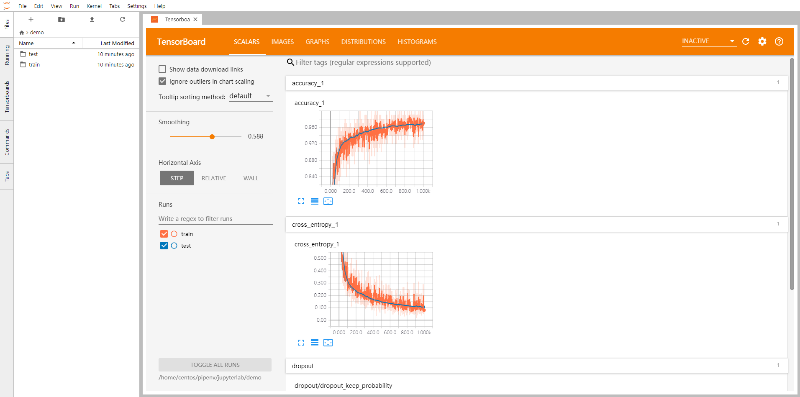

# Build docker image

	docker build -t xebikart_ml .

# Start docker image with your workspace

	docker run -d -v $(pwd)/workspace:/workspace -v $(pwd)/../xebikart-ml-tubes:/workspace/xebikart-ml-tubes -p 8888:8888 -p 5000:5000 xebikart_ml

Then open your browser on http://localhost:8888/

# Jupyter Tensorboard extension

A JupyterLab extension for tensorboard.

> Note: This project is just a frontend extension for tensorboard on jupyterlab. It uses the [jupyter_tensorboard](https://github.com/lspvic/jupyter_tensorboard) project as tensorboard backend.

## Special Thanks

Thanks [lspvic](https://github.com/lspvic) and his excellent work for creating [tensorboard](https://github.com/lspvic/jupyter_tensorboard) for jupyter notebooks.

# Credits
- https://github.com/tawnkramer/donkey_gym
- https://github.com/araffin/learning-to-drive-in-5-minutes
- https://github.com/r7vme/learning-to-drive-in-a-day
